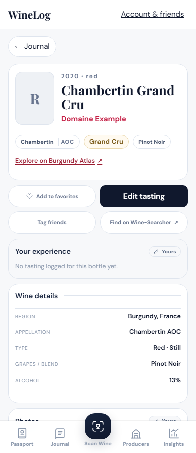
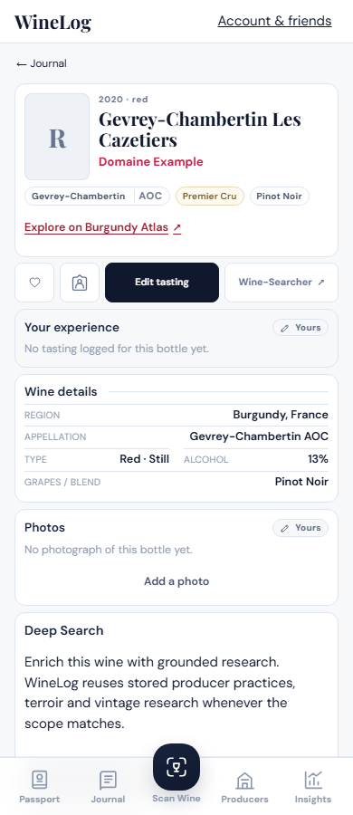
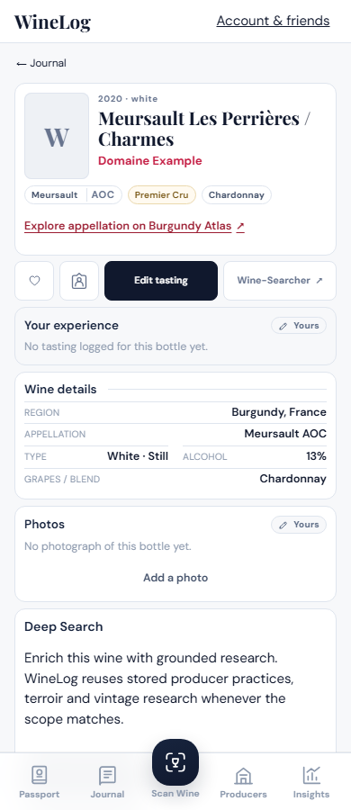
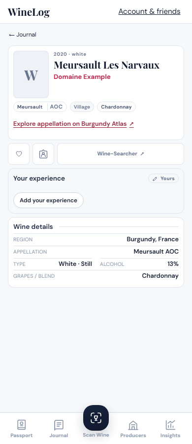
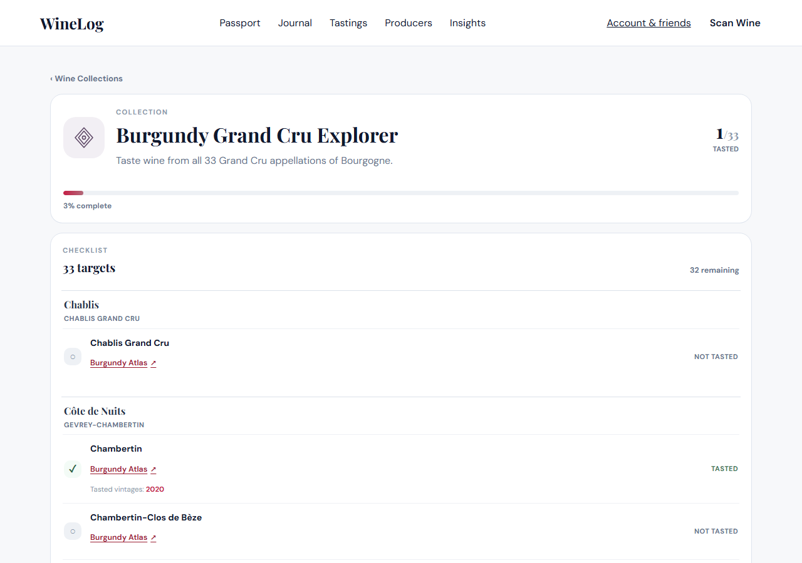

# Burgundy Atlas links

Wine details offer **Explore on Burgundy Atlas** below the identity pills for a mapped Burgundy Grand Cru, or a named Premier Cru whose village appellation can also be identified. Village wines and Premier Crus without one mapped plot use **Explore appellation on Burgundy Atlas**, opening the corresponding village or Premier Cru area. The same specific-cru link appears as **Burgundy Atlas** on the rows of two curated Grand Cru collections, including untasted rows:

- Burgundy Grand Cru Explorer - all 33 rows link
- Domaine de la Romanée-Conti - 9 of 10 rows link

The three narrower Burgundy checklists - Côte de Nuits Grand Crus, Côte de Beaune Grand Crus and The Nine Gevrey Grand Crus - are in `curatedLaunch.ts`'s `removed` set and are not served. The small membership list lives in `atlasCollections.ts`; `curatedLaunch.ts` validates it and refuses to boot on an id curation has dropped. The detail page imports only the membership list, avoiding a download of the complete collection catalogue.

The Domaine checklist is a producer's range rather than a list of appellations, so it is the first collection where a row deliberately carries no link: `Cuvée Duvault-Blochet` is a cuvée name, not an appellation, and the matcher withholds rather than guess at the Vosne-Romanée Premier Cru behind it. That withholding is what lets a producer collection join at all. Rows that do link point at the appellation, never at the Domaine's parcel inside it - a DRC Échezeaux and anyone else's reach the same Échezeaux page - because a parcel is not what Atlas maps here.

Owner and shared wine pages use the same component. Links open in a new tab, leaving the tasting and its navigation state available. Existing links to tasted vintages remain separate.

## Review previews

Screenshots of the implementation with synthetic example wine and progress data:











## Mapping and matching

`src/lib/places/burgundyAtlasLinks.json` maps WineLog's existing canonical place IDs to complete URLs published in [Atlas's sitemap](https://burgundyatlas.com/sitemap.xml). All 33 destinations were checked on 2026-09-21 for HTTP 200, an exact canonical URL and matching Grand Cru metadata. Chambertin's designation and appellation pages were also compared in the browser.

For the Côte d'Or, the mapping uses 32 **wine designation** pages, which focus the named vineyard and provide its terrain context. La Romanée points specifically to the Grand Cru in Vosne-Romanée, excluding its Premier Cru namesakes. Chablis Grand Cru uses its **appellation** page: a bottle naming only that appellation does not identify one of its seven climats. Atlas remains responsible for the mapped data and boundaries.

Grand Cru matching accepts case, accent and punctuation variations, AOC/AOP markers, Grand Cru prefixes/suffixes and a small explicit alias set. It never searches arbitrary wine-name substrings. A supplied non-French country, incompatible region/subregion, contradictory cru tier or disputed reference suppresses the wine link. A specific, exact Grand Cru appellation can match when broader fields are absent. Village names in the region field are not treated as legal parents of Grand Cru appellations.

### Named Premier Crus on wine details

`burgundyAtlasPremierCruLinks.json` contains 630 Premier Cru designation records across 29 appellations, selected from the public canonical registry linked by Atlas's place pages and cross-checked against its sitemap. Each destination returned HTTP 200 with the exact canonical URL, name and Premier Cru classification on 2026-09-22. The file stores factual names, published paths and geographic context; no map geometry is copied. The Premier Cru data is imported by wine details, not by the collection page.

Both owner and shared details accept a cru in the wine title, combined appellation, or recorded reference site/parcel. Matching requires the village as well as the cru, and a `premier_cru` classification or an explicit Premier Cru / 1er Cru marker. For example:

- Gevrey-Chambertin + Les Cazetiers links to the Les Cazetiers designation.
- Meursault + Les Perrières and Puligny-Montrachet + Les Perrières link to different destinations.
- Clos des Perrières is preserved as the full name, rather than shortened to Perrières.
- An unnamed, unknown or mixed plot uses the Premier Cru appellation fallback below. Contradictory villages or a disputed reference still produce no link.

Wine titles may include producer/vintage text around a complete cru name. Appellation and reference fields must identify a whole place. Case, accents, punctuation, published `ou` alternatives and leading article omission are supported; fuzzy spelling and partial word matching are not. An explicit Premier Cru never falls back to a Grand Cru namesake such as La Romanée.

Specific-plot coverage excludes 36 Atlas designation records without a mapped presentation, including Chablis Montée de Tonnerre. Atlas coverage is not the same as a complete inventory of Burgundy Premier Crus. These wines can now use their Premier Cru appellation page when the village and tier are established; Montée de Tonnerre, for example, links to Chablis Premier Cru.

Refresh and verify the mapping, then review the generated diff:

```sh
npx vite-node --config vitest.config.ts scripts/sync_burgundy_atlas_premiers.ts
```

### Village and Premier Cru appellation fallbacks

`burgundyAtlasAppellationLinks.json` adds 43 village destinations and 29 Premier Cru appellation destinations. All 72 URLs were checked on 2026-09-22 for HTTP 200, exact canonical URL, matching name and classification. They are published appellation records, not guessed village-map URLs.

| Recorded wine | Destination |
| --- | --- |
| Village wine, including a named village-level lieu-dit | Village appellation |
| Premier Cru with one confidently matched plot | Specific Premier Cru designation |
| Premier Cru without a plot name, with multiple plots, or with an unmapped plot | Premier Cru appellation |
| Conflicting country, region, village, tier or disputed identity | No link |

The fallback independently establishes the appellation before selecting a destination. A stored village cannot be reinterpreted as a climat in another village. Longer names such as Petit Chablis or Savigny-lès-Beaune take precedence over names nested inside them. A broad subregion alone does not establish its namesake village appellation. Named vineyards are removed only while checking the geographic context, so a Meursault climat called Blagny does not become the Blagny appellation.

The visible **Explore appellation on Burgundy Atlas** label distinguishes the broader destination from the specific-cru link. Its accessible name includes the village and Premier Cru tier when relevant. A Premier Cru never falls back to a village-tier page: if Atlas lacks the matching Premier Cru area, the link is withheld. The registry currently has no mapped presentation for Côte de Beaune-Villages or the Premier Cru pages of Pouilly-Loché and Pouilly-Vinzelles; those destinations are excluded. Existing Grand Cru collection links are unchanged.

Refresh and verify the appellation mapping separately:

```sh
npx vite-node --config vitest.config.ts scripts/sync_burgundy_atlas_appellations.ts
```

The mapping is shared static frontend data. There are no migrations, database reads, AI calls, embeds or automatic requests to Atlas. Navigation sends only the public Atlas destination; `noopener noreferrer` omits the WineLog referrer and opener.

## Extending coverage

Additional mapped coverage, further producer ranges and internal vineyard pages remain follow-up work. Wines without a verified destination at the appropriate tier show no link. A new collection must be curated - that is, absent from `removed` - before `atlasCollections` may name it. Its rows need not all resolve, but every row that does not must be named in the `unlinkedRows` exception list in `tests/unit/burgundyAtlas.test.ts`, so a row that quietly stops linking fails rather than disappears into a count. A new destination must be selected from Atlas's published records and checked for name, classification and geographic scope. Grand Crus use WineLog's canonical place identity; Premier Cru climats retain their published Atlas designation identity and village context. Do not generate Atlas IDs or substitute a nearby vineyard. Update `verifiedAt` only after checking the complete mapping again.

## Validation

- Focused Vitest checks: all 33 Grand Crus, 630 Premier Cru plots and 72 appellation destinations, tier preservation, mixed-plot fallback, every claimed collection live and linked bar named exceptions, per-row destinations for the Domaine checklist, name collisions, geography conflicts and wine-detail regressions.
- Chromium: owner/shared Grand Cru, specific Premier Cru and appellation links, all 33 checklist links, preserved tasting links, no background Atlas requests, new-tab behavior, recorded vineyard matching and uncertain identity suppression.
- Layouts checked at 320, 390 and 1280 pixels; screenshots reviewed for overlap and clipping.
- TypeScript, production build and lint.

Run the focused checks with:

```sh
npx vitest run tests/unit/burgundyAtlas.test.ts tests/unit/burgundyAtlasPremierCru.test.ts tests/unit/burgundyAtlasAppellation.test.ts tests/unit/wineClassificationDisplay.test.tsx tests/unit/wineDetailOrder.test.ts tests/unit/wineDetailMapping.test.ts
npx playwright test tests/e2e/burgundy-atlas.spec.ts --project=chromium
npm run build
npm run lint
```
