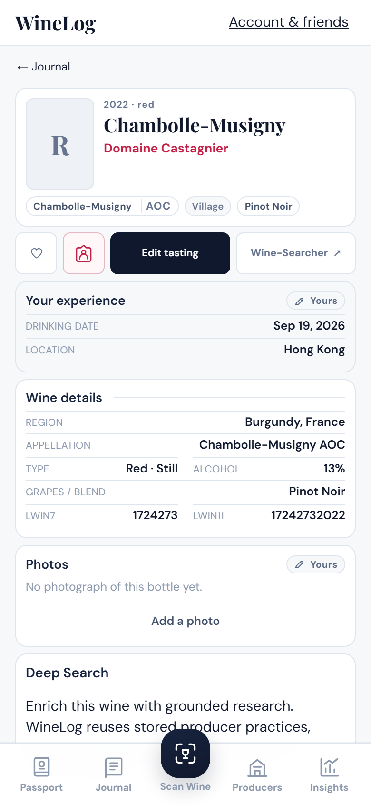
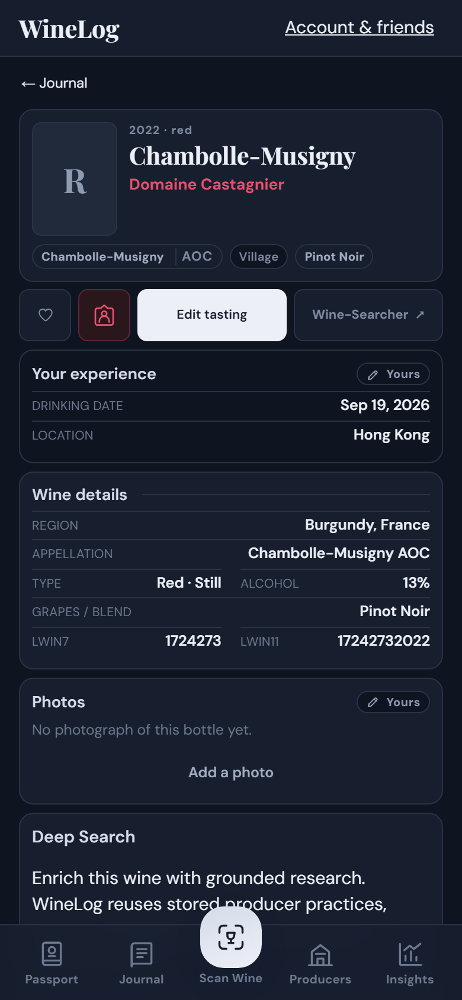
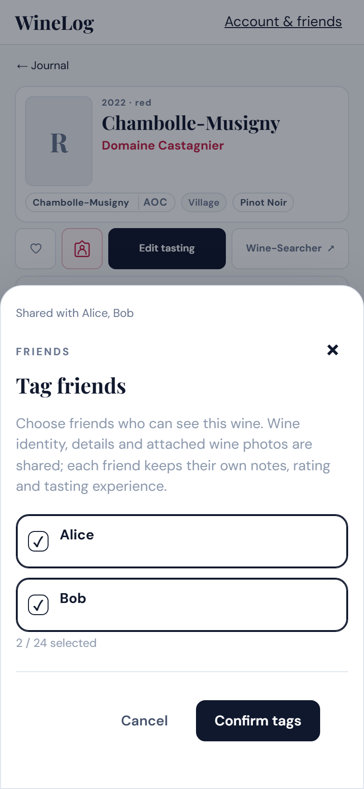
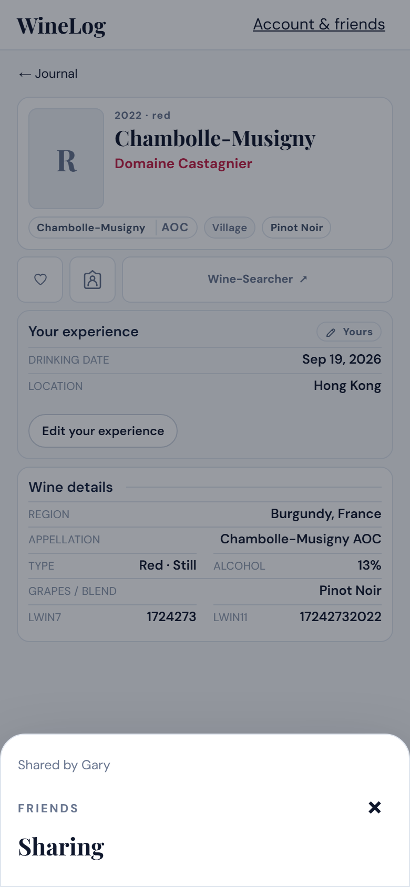

# Compact wine detail preview

Screenshots of the implemented page at a 390 × 844 mobile viewport, using a member account, sample wine data and the no-photo placeholder. The same compact layout applies to owner accounts. The reference has been manually confirmed, so the LWIN review controls are hidden.

The action row contains Favourite, Tag friends (person icon), Edit tasting, and Wine-Searcher. Type/Alcohol and LWIN7/LWIN11 each share a row. The mobile layout retains 44px action targets and safe-area spacing.

| Light | Dark |
| --- | --- |
|  |  |

The person icon is coloured when your wine has recipients. The saved relationship is shown inside the sheet, independently of unsaved picker changes. For a wine shared with you, the icon stays neutral and opens a read-only sheet naming only the sharer; it never loads the sharer's recipient list.

| Your wine: sharing sheet | Received wine: sharing sheet |
| --- | --- |
|  |  |

[Received wine detail preview](compact-wine-detail-shared.png)
