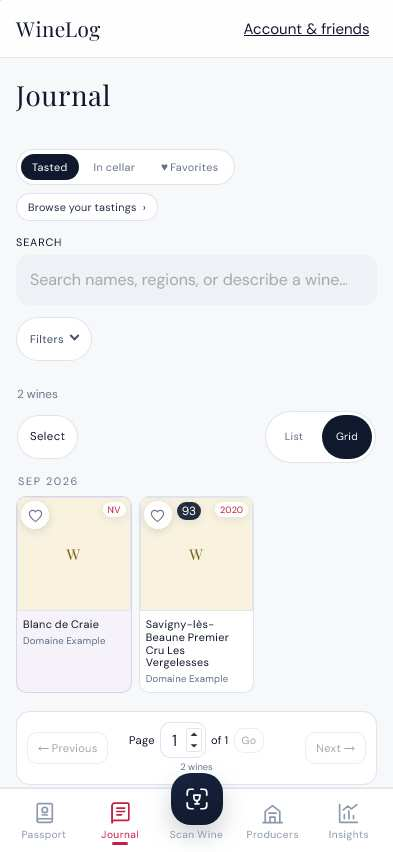
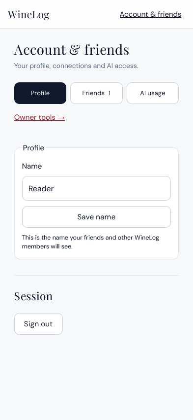
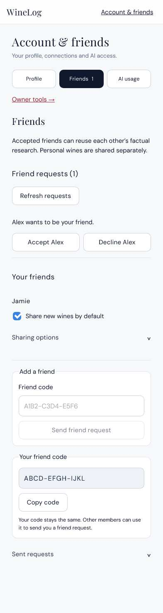
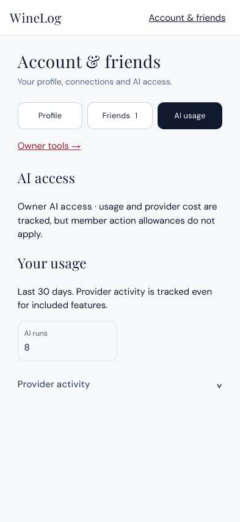
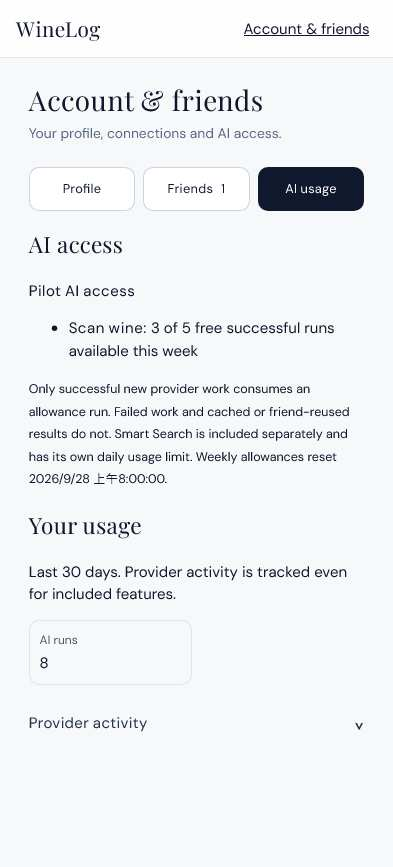
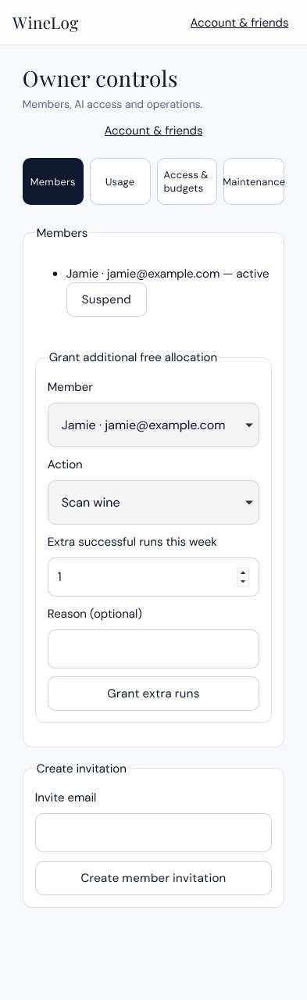
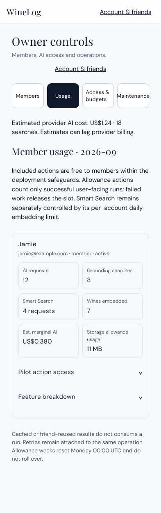
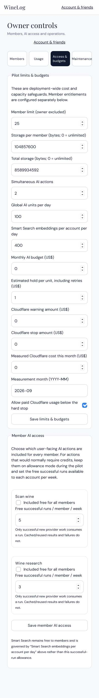
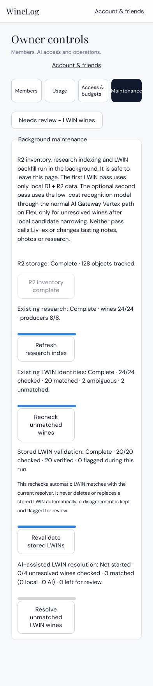
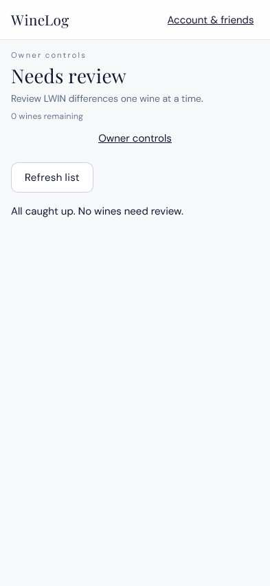

# Mobile review previews

Captured from the PR implementation with synthetic data at 393px width, light appearance, using WebKit mobile emulation. These are screenshots, not live controls or production records. Journal shows the phone viewport; other images show full content with the fixed bottom navigation hidden so it does not obscure content.

## Journal

Cards retain the shared-wine colour and omit visible shared-by, tasting/event, venue and date text.

## Account and friends

### Profile

### Friends

### AI usage — owner

### AI allowance — member

## Owner controls

### Members

### Usage

### Access and budgets

### Maintenance

### LWIN review

